# Z-Image Data Pipeline

A high-performance, distributed image data processing pipeline built with Ray, featuring Rust-accelerated operators and GPU-optimized CLIP embedding extraction.

## Architecture

### Pipeline Overview

```mermaid
flowchart TB
    subgraph Driver["🖥️ Ray Driver (main.py)"]
        Config[Config Loader]
        Executor[Executor]
        Progress[Progress & Stats]
    end

    subgraph ObjectStore["📦 Ray Object Store (Shared Memory)"]
        Batches["Batch Records: list[dict]"]
    end

    subgraph Stage0["⚙️ Stage 0: CPU Worker Pool (num_replicas=8)"]
        direction LR
        W0["Worker 0"]
        W1["Worker 1"]
        W2["Worker 2"]
        W3["..."]
        W7["Worker 7"]
    end

    subgraph Stage1["🎮 Stage 1: GPU Worker Pool (num_replicas=2)"]
        direction LR
        GPU0["GPU Worker 0<br/>CLIP + ThreadPool"]
        GPU1["GPU Worker 1<br/>CLIP + ThreadPool"]
    end

    subgraph Output["💾 Output"]
        Writer[Parquet Writer]
    end

    HF["🤗 HuggingFace<br/>Streaming"] --> Driver
    Driver -->|"ray.remote()"| ObjectStore
    ObjectStore -->|"Load Balance"| Stage0
    Stage0 --> ObjectStore
    ObjectStore -->|"Load Balance"| Stage1
    Stage1 --> Writer
```



### Worker Pool Detail

```mermaid
flowchart LR
    subgraph Batches["Incoming Batches"]
        B0["Batch 0"]
        B1["Batch 1"]
        B2["Batch 2"]
        B3["Batch 3"]
        B4["Batch 4"]
        B5["Batch 5"]
        B6["Batch 6"]
        B7["Batch 7"]
    end

    subgraph Stage0["Stage 0: CPU Pool (8 workers)"]
        direction TB
        subgraph Row1[" "]
            direction LR
            CW0["Worker 0<br/>🦀 Quality"]
            CW1["Worker 1<br/>🦀 Quality"]
            CW2["Worker 2<br/>🦀 Quality"]
            CW3["Worker 3<br/>🦀 Quality"]
        end
        subgraph Row2[" "]
            direction LR
            CW4["Worker 4<br/>🦀 Quality"]
            CW5["Worker 5<br/>🦀 Quality"]
            CW6["Worker 6<br/>🦀 Quality"]
            CW7["Worker 7<br/>🦀 Quality"]
        end
    end

    subgraph Stage1["Stage 1: GPU Pool (2 workers)"]
        direction TB
        GW0["GPU 0<br/>CLIP ViT-B-32"]
        GW1["GPU 1<br/>CLIP ViT-B-32"]
    end

    B0 --> CW0
    B1 --> CW1
    B2 --> CW2
    B3 --> CW3
    B4 --> CW4
    B5 --> CW5
    B6 --> CW6
    B7 --> CW7

    CW0 & CW1 & CW2 & CW3 --> GW0
    CW4 & CW5 & CW6 & CW7 --> GW1
```



### Pipeline Execution Flow


### Timeline View (8 CPU workers, 2 GPU workers)


> **Key Points**:
>
> - **CPU Pool**: High parallelism (e.g., 8 workers) for metadata extraction, quality assessment, filtering
> - **GPU Pool**: Limited by GPU memory (e.g., 2 workers), each with its own CLIP model instance
> - **Load Balancing**: Ray automatically distributes batches to available workers in each pool

### Operator Hierarchy


> 🦀 = Rust Accelerated (via PyO3)

## Features

### Operator Types

| Type | Description | Example |
|------|-------------|---------|
| **Refiner** | Enriches records with new fields (inplace) | `ImageMetadataRefiner`, `TechnicalQualityRefiner`, `ImageClipEmbeddingRefiner` |
| **Filter** | Filters records based on conditions | `QualityFilter` |
| **Deduplicator** | Removes duplicate records | `PhashDeduplicator` |

### Performance Optimizations

| Component | Optimization | Speedup |
|-----------|-------------|---------|
| `TechnicalQualityRefiner` | Rust + Rayon parallel | ~3x |
| `PhashDeduplicator` | Rust + Rayon parallel | ~2.5x |
| `ImageClipEmbeddingRefiner` | GPU batch inference + ThreadPool preprocessing | ~1.5x |

## Installation

```bash
# Clone the repository
git clone https://github.com/your-org/datapipeline_z_image.git
cd datapipeline_z_image

# Install dependencies with uv
uv sync

# Build Rust accelerated operators (optional but recommended)
cd rust && ./build.sh && cd ..
uv pip install dist/*.whl
```

## Quick Start

```bash
# Run the pipeline with default configuration
python main.py --config pipeline_config.yaml
```

## Configuration

### `pipeline_config.yaml`

```yaml
# Data source
data_loader:
  type: HuggingFaceDataLoader
  params:
    dataset_name: "jp1924/Laion400m-1"
    split: "train"
    streaming: true

# Processing stages
stages:
  - name: basic_stage
    operators:
      - name: image_metadata_refiner
      - name: technical_quality_refiner  # Rust-accelerated
      - name: quality_filter
        params:
          min_width: 128
          min_height: 128
          max_compression_artifacts: 0.8
          min_information_entropy: 0.0
      - name: phash_deduplicator  # Rust-accelerated
    worker:
      num_replicas: 2
      resources:
        cpu: 1

  - name: embedding_stage
    operators:
      - name: image_clip_embedding_refiner
        params:
          model_name: "ViT-B-32"
          pretrained: "openai"
          device: "auto"  # auto-detect: mps > cuda > cpu
          inference_batch_size: 128
          use_fp16: true  # CUDA only
          preprocess_workers: 4
    worker:
      num_replicas: 1
      resources:
        cpu: 2

# Output
data_writer:
  type: ParquetDataWriter
  params:
    output_path: "./parquet_data"
    table_name: "image_profiles"

# Execution settings
executor:
  max_samples: 1000
  batch_size: 200
  dedup_num_buckets: 2
```

## Operators

### Refiners

#### `ImageMetadataRefiner`

Extracts basic image metadata.

**Output fields:**

- `width`: int - Image width in pixels
- `height`: int - Image height in pixels
- `file_size_bytes`: int - File size in bytes
- `format`: str - Image format (JPEG, PNG, etc.)

#### `TechnicalQualityRefiner`

Assesses technical quality metrics (Rust-accelerated).

**Output fields:**

- `compression_artifacts`: float - Compression artifact score (0-1, lower is better)
- `information_entropy`: float - Information entropy (higher = more detail)

#### `ImageClipEmbeddingRefiner`

Extracts CLIP embeddings using OpenCLIP models (GPU-optimized).

**Parameters:**

- `model_name`: OpenCLIP model name (default: `"ViT-B-32"`)
- `pretrained`: Pretrained weights (default: `"openai"`)
- `device`: Device selection (`"auto"`, `"cuda"`, `"mps"`, `"cpu"`)
- `inference_batch_size`: GPU batch size (default: 128)
- `use_fp16`: Use half precision on CUDA (default: true)
- `preprocess_workers`: Parallel preprocessing threads (default: 4)

**Output fields:**

- `image_clip_emb_{model_name}`: list[float] - CLIP embedding vector

### Filters

#### `QualityFilter`

Filters images based on quality criteria.

**Parameters:**

- `min_width`: Minimum width (default: 256)
- `min_height`: Minimum height (default: 256)
- `max_compression_artifacts`: Maximum artifacts score (default: 0.8)
- `min_information_entropy`: Minimum entropy (default: 3.0)

### Deduplicators

#### `PhashDeduplicator`

Removes duplicate images using perceptual hashing (Rust-accelerated).

**Parameters:**

- `hash_size`: Hash size (default: 16, produces 256-bit hash)

## Performance

Benchmark on Mac M1 Pro (MPS):

```
============================================================
Operator Performance Statistics:
============================================================

stage_0:
  [Stage Summary]
    Records: 1000
    Total time: 0.61s
    Throughput: 1630 records/sec

  ImageMetadataRefiner:     27,000 records/sec
  TechnicalQualityRefiner:   2,500 records/sec (Rust)
  QualityFilter:         4,200,000 records/sec
  PhashDeduplicator:         1,500 records/sec (Rust)

stage_1:
  [Stage Summary]
    Records: 898
    Total time: 6.80s
    Throughput: 132 records/sec

  ImageClipEmbeddingRefiner:   132 records/sec (GPU)
============================================================
```

## Rust Accelerated Operators

The `rust/` directory contains Rust implementations for CPU-intensive operations:

```bash
# Build Rust extension
cd rust
./build.sh

# Install the wheel
uv pip install ../dist/rust_accelerated_ops-*.whl

# Test
python test.py
```

### Functions

| Function | Description |
|----------|-------------|
| `assess_quality(image_bytes)` | Single image quality assessment |
| `assess_quality_batch(image_bytes_list)` | Batch quality assessment (parallel) |
| `compute_phash(image_bytes, hash_size)` | Single image perceptual hash |
| `compute_phash_batch(image_bytes_list, hash_size)` | Batch perceptual hash (parallel) |

## Project Structure

```
datapipeline_z_image/
├── framework/
│   ├── operator.py      # Base classes: Operator, Refiner, Filter, Deduplicator
│   ├── executor.py      # Ray-based distributed executor
│   ├── backend.py       # Deduplication backends
│   └── base.py          # Configuration dataclasses
├── operators/
│   ├── refiners/
│   │   ├── image_metadata.py
│   │   ├── technical_quality.py
│   │   └── image_clip_embedding.py
│   ├── filters/
│   │   └── quality_filter.py
│   └── dedup/
│       └── phash_dedup.py
├── loaders/
│   └── huggingface_loader.py
├── writers/
│   └── parquet_writer.py
├── rust/
│   ├── src/lib.rs       # Rust implementation
│   ├── Cargo.toml
│   └── build.sh
├── main.py              # Entry point
├── pipeline_config.yaml # Configuration
└── README.md
```

## Extending the Pipeline

### Custom Refiner

```python
from framework import Refiner

class MyCustomRefiner(Refiner):
    def refine_batch(self, records: list[dict]) -> None:
        """Modify records inplace to add new fields."""
        for record in records:
            record["my_new_field"] = compute_something(record)

    def get_output_schema(self) -> dict:
        return {"my_new_field": pa.float32()}
```

### Custom Filter

```python
from framework import Filter

class MyCustomFilter(Filter):
    def should_keep_batch(self, records: list[dict]) -> list[bool]:
        """Return list of booleans indicating which records to keep."""
        return [record.get("score", 0) > 0.5 for record in records]
```

### Custom Deduplicator

```python
from framework import Deduplicator

class MyCustomDeduplicator(Deduplicator):
    def get_dedup_keys_batch(self, records: list[dict]) -> list[str]:
        """Return list of deduplication keys."""
        return [record.get("hash", record["id"]) for record in records]
```

## References

- Paper: [Z-Image: An Efficient Image Generation Foundation Model](https://arxiv.org/pdf/2511.22699)
- GitHub: <https://github.com/Tongyi-MAI/Z-Image>
- OpenCLIP: <https://github.com/mlfoundations/open_clip>

## License

MIT License
